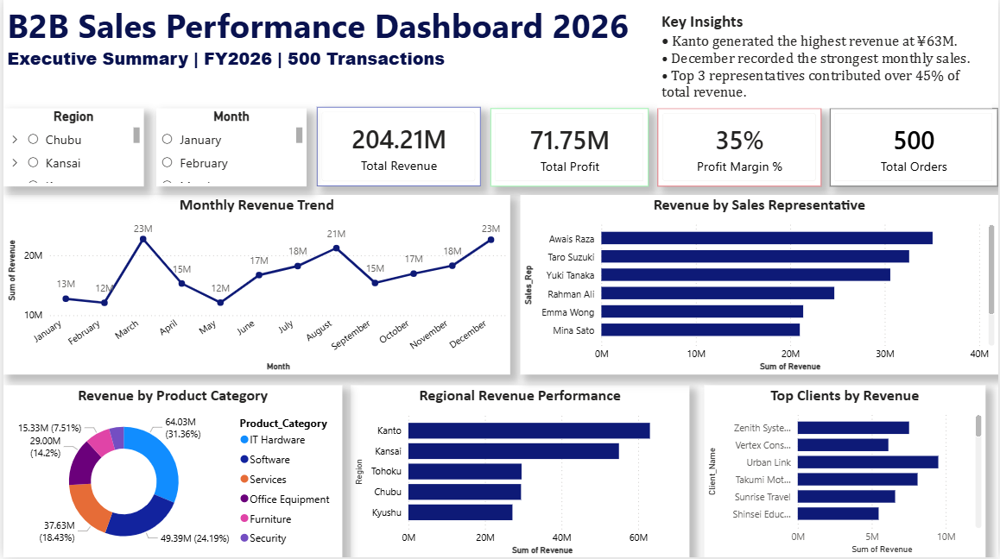

# 📊 B2B Sales Performance Dashboard 2026

## 📌 Project Overview

This project is an end-to-end **Business Intelligence dashboard** built using **Power BI, SQL, Excel, and DAX** to analyze B2B sales performance data for the year 2026.

The dashboard provides management-level insights into:

- Revenue performance  
- Profitability  
- Monthly sales trends  
- Regional performance  
- Client contribution  
- Sales representative results  

Designed with an interactive and professional reporting layout, this project demonstrates practical skills in:

- Data Cleaning  
- SQL Querying  
- KPI Development  
- Power BI Dashboard Design  
- Business Insight Generation  
- Data Storytelling  

---

## 🛠 Tools & Technologies Used

- **Power BI** – Dashboard development & visualization  
- **SQL Server** – Querying and business metrics analysis  
- **Excel / CSV** – Raw data preparation and import  
- **DAX** – KPI calculations and custom measures  
- **GitHub** – Portfolio project hosting  

---

## 📂 Dataset Information

The dataset contains **500 B2B sales transactions** with the following fields:

- Order ID  
- Order Date  
- Client Name  
- Region  
- City  
- Product Category  
- Sales Representative  
- Revenue  
- Profit  
- Quantity  
- Payment Method  

---

## 📈 Dashboard Features

### Executive KPI Summary

- **Total Revenue:** ¥204.21M  
- **Total Profit:** ¥71.75M  
- **Profit Margin:** 35%  
- **Total Orders:** 500  

### Interactive Filters

- Region  
- Month  

### Visual Analysis

- Monthly Revenue Trend  
- Revenue by Sales Representative  
- Revenue by Product Category  
- Regional Revenue Performance  
- Top Clients by Revenue  

---

## 🔍 Key Business Insights

- Kanto generated the highest revenue at **¥63M**  
- December recorded the strongest monthly sales month  
- Top 3 sales representatives contributed over **45%** of total revenue  
- Revenue concentration identified among major regions and key clients  

---

## 🧠 SQL Analysis Performed

Used SQL queries for:

- Total Revenue / Profit Calculation  
- Revenue by Region  
- Profit Margin by Region  
- Top Clients by Revenue  
- Best Sales Representatives  
- Monthly Sales Trend  
- Product Category Performance  
- Payment Method Usage  

---

## 📸 Dashboard Preview



---

## 📁 Project Structure

```text
B2B-Sales-Performance-Dashboard/
│── data/
│   └── sales_data.csv
│── sql/
│   └── sales_queries.sql
│── dashboard/
│   └── powerbi_dashboard.png
│── README.md
